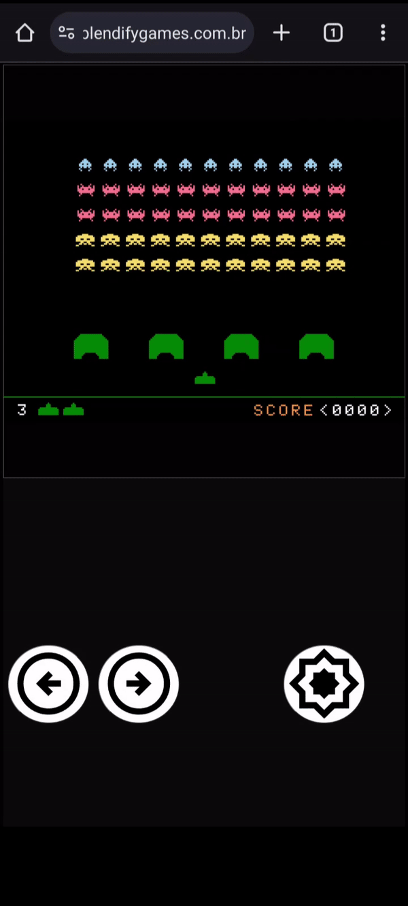

# Workaround for creating gamepads in HTML using pygame-web
Published by [Vinícius F. Maciel](https://github.com/ViniciusFM) (May 30, 2024)

(Veja em [pt-br](mobile-gamepads_pt-br.md))

## Introduction

This article will present a simplistic yet functional method for allowing a game created using [pygame-ce](https://github.com/pygame-community/pygame-ce) and ported to the web to interpret commands from a gamepad embedded in the HTML of a host page.

To understand this article, consider the following scenario:

* The object of analysis here is the game developed by the [Blendify Games](https://www.blendifygames.com.br/) team, the *libre* and open-source [Spyce Invaders](https://github.com/Blendify-Games/SpyceInvaders/) (GPLv3), which is distributed in desktop, web-desktop, and web-mobile versions.
* A web page hosting the game mentioned above, made in pygame-ce and ported to the web with [pygame-web](https://pygame-web.github.io/) (Pygbag).
* The application is running in an *iframe* element on the host page.
A gamepad with three buttons is constructed on the host page containing: two directional buttons (&larr;, &rarr;) and an action button (💥).
* The game originally accepts commands only from the keyboard. The HTML buttons perform actions mapped to keyboard keys in the game, as in the snippet below: (access the full code [here](https://github.com/Blendify-Games/SpyceInvaders/blob/master/game.py))

##### Code: *MAPEV - mapping events from html to pygame*

```python
MAPEV = {
    'action': pygame.K_SPACE,
    'left': pygame.K_a,
    'right': pygame.K_d
}
```

* The version created with the gamepad is designed exclusively for mobile devices. Obviously, this characteristic does not prevent the same methodology from being applied to other types of devices with web browsers.

* To see the result of applying this methodology, access the game on the [BlendifyGames](https://www.blendifygames.com.br/spyceinvaders) platform using a mobile device:

    <p align="center" width="100%">
        <br>
        <b>Figure: <i>Screen recording of Spyce Invaders running on web-mobile</i></b>
    </p>

## The gamepad on the HTML page

The gamepad has a simple configuration in HTML. It consists of a `div` named `gamepad` that will receive all touch events on the screen.

##### Code: *spyceinvaders.html*
```html
<!-- spyceinvaders.html -->
<!-- html body -->
    <div id="gamespot__mobile">
        <div id="gamespot__mobile__run-button-container" class="">
            <button id="gamespot__mobile__run-button">
                <i class="material-symbols-outlined">play_circle</i>
                <span> Spyce Invaders </span>
            </button>
        </div>
        <iframe id="gamespot__mobile__game-frame" mozallowfullscreen="true" msallowfullscreen="true" src="" scrolling="no" webkitallowfullscreen="true" allow="autoplay; fullscreen *; geolocation; microphone; camera; midi; monetization; xr-spatial-tracking; gamepad; gyroscope; accelerometer; xr; cross-origin-isolated" allowtransparency="true" frameborder="0" allowfullscreen="true"></iframe>
        <div id="gamepad">
            <div id="gamepad__1__container">
                <div id="gamepad__1__dpad-container">
                    <button id="left"></button>
                    <button id="right"></button>
                </div>
                <div id="gamepad__1__actionbtn-container">
                    <button id="action"></button>
                </div>
            </div>
        </div>
    </div>
<!-- html body -->
```

The `gamepad__1__dpad-container` element will contain the directional buttons, while the `gamepad__1__actionbtn-container` will contain only the action button. Note that the buttons are configured with IDs corresponding to the keys of the [MAPEV](#code-mapev---mapping-events-from-html-to-pygame) dictionary inserted within the game [Spyce Invaders](https://github.com/Blendify-Games/SpyceInvaders).

I will not go into details regarding the graphical specification via CSS, since the code itself is not very "good." There are several styling issues on the page that I cannot fix right now, but you can find someone with CSS skills to do a good job 🥲.

## The functioning of the gamepad in JavaScript

The JavaScript code that handles the `touch events` on the gamepad component is shown below. I named it `gamepad-1.js` because I plan to create other gamepad configurations for other games in the future.

##### Code: *gamepad-1.js*
```JavaScript
// gamepad-1.js

const gamepad = document.getElementById('gamepad');
const dpad_c = document.querySelectorAll('#gamepad__1__dpad-container button');
const actbtn = document.querySelectorAll('#gamepad__1__actionbtn-container button')[0];
const frame = document.getElementById('gamespot__mobile__game-frame');

var GPAD_BTNS = [dpad_c[0], dpad_c[1], actbtn];

// this is the structure that will be emitted to
// the SpyceInvaders game. 
var ACTIVE_BUTTONS = [];

// avoid to open menu when long pressing the gamepad components
window.oncontextmenu = function(event) {
    event.preventDefault();
    event.stopPropagation();
    return false;
};

// ------------ Help functions

// if button on, emit its ID to ACTIVE_BUTTON, stop emitting otherwise.
function toggle(button, on) {
    if(on) {
        button.classList.add('pressed');
        if(!(ACTIVE_BUTTONS.includes(button.id)))
            ACTIVE_BUTTONS.push(button.id);
    }
    else {
        button.classList.remove('pressed');
        ACTIVE_BUTTONS = ACTIVE_BUTTONS.filter(id => id !== button.id);
    }
    // this is the message sent to the game iframe
    frame.contentWindow.postMessage(ACTIVE_BUTTONS, "*");
}

// get button widget on where is the touch coordinates (x,y)
// returns null if no button found
function getButtonFromPoint(x, y) {
    for(let i = 0; i < GPAD_BTNS.length; i++) {
        const btn = GPAD_BTNS[i];
        const rect = btn.getBoundingClientRect();
        // is inside button's boundaries?
        if(x >= rect.left && x <= rect.right &&
           y >= rect.top &&  y <= rect.bottom)
           return btn;
    }
}

// ------------ Listeners
// ---- The touch handler functions permit two buttons to
// ---- be pressed simultaneously.

// every time a touch starts, turn "on" the button
function handleTouchOn(e) {
    e.preventDefault();
    const touches = e.touches;
    for(let i = 0; i < touches.length; i++) {
        const touch = touches[i];
        const button = getButtonFromPoint(touch.clientX, touch.clientY)
        if(button) {
            toggle(button, true);
        }
    }
}

// every time a touch end, turn "off" the button released
function handleTouchOff(e) {
    e.preventDefault();
    const touches = e.changedTouches;
    for(let i = 0; i < touches.length; i++) {
        const touch = touches[i];
        const button = getButtonFromPoint(touch.clientX, touch.clientY)
        if(button) {
            toggle(button, false);
        }
    }
}

gamepad.addEventListener('touchstart', handleTouchOn, false);
gamepad.addEventListener('touchend', handleTouchOff, false);
```

The most important line of this code is shown below:

```JavaScript 
frame.contentWindow.postMessage(ACTIVE_BUTTONS, "*");
```

This line sends the `ACTIVE_BUTTONS` *array* to the iframe that contains the HTML code generated by pygbag for the game. We will refer to this integrated page as `game.html`, although the execution of the pygbag script creates it as `index.html`.

Here, the `postMessage` method is called from the `Window` object of the *iframe*. The `postMessage` is a secure method that allows *cross-origin* communication between `Window` objects.

In `game.html`, we need to create an event listener to receive the message (see the [postMessage](https://developer.mozilla.org/en-US/docs/Web/API/Window/postMessage) documentation). This procedure will be detailed in the next [section](#redirecting-messages-sent-by-the-gamepad).

## Redirecting messages sent by the gamepad

Within the *iframe* code, on the `game.html` page, the following lines were inserted. The code should contain an event listener for messages sent by `postMessage` on the host page.

##### Code: *game.html*
```HTML
<!-- game.html -->

<!-- pygbag code until last script tag -->
<script type="application/javascript">
    
    // ------- pygabg JS code -------

    // create a property for window named "pressedButtons"
    // this property will be accessed by the game in pygame
    // it will contain exactly the same values from
    // ACTIVE_BUTTONS from gamepad-1.js.

    window.pressedButtons = [];

    window.addEventListener("message", (e) => {
        if(Array.isArray(e.data)) {
            window.pressedButtons = e.data;
        }
    });

</script>
```

The block `window.addEventListener("message", ...` captures the message from the host page. Note that an *array* property named `pressedButtons` has been added to the `Window` object simply to hold the value of `ACTIVE_BUTTONS` emitted by `postMessage` in [gamepad-1.js](#code-gamepad-1js).

The property `window.pressedButtons = []` will be accessed by the SpyceInvaders code. This communication will be exemplified in the next [section](#receiving-messages-in-the-game).

## Receiving messages in the game

A small change was made in the original Spyce Invaders to capture gamepad events from the `window.pressedButtons` *array*:

1) The dictionary mapping gamepad events to keys, `MAPEV`, was added.

2) A method `is_key_pressed` was added to identify pressed key events in the game. Note that the method was implemented to work well for both the desktop and web versions, as discussed earlier.

##### Code: [*game.py*](https://github.com/Blendify-Games/SpyceInvaders/blob/master/game.py)
```Python
# Mapping gamepad events to keyboard
MAPEV = {
    'action': pygame.K_SPACE,
    'left': pygame.K_a,
    'right': pygame.K_d
}

class GameInput(object):
    # -------- game input code --------
    
    def is_key_pressed(self, key):
        ''' 
        this method check if a pygame key is pressed.
        calling example: 
            self.is_key_pressed(pygame.K_SPACE)
        '''

        # check if the system running the game is based 
        # in "emscripten", used by pygbag. This permit 
        # accessing the# window properties of the running page
        if sys.platform == 'emscripten':
            # check if pressedButton exists/contain events
            if platform.window.pressedButtons:
                for ev in platform.window.pressedButtons:
                    if MAPEV[ev] == key:
                        return True
        # the desktop version only checks the get_pressed from pygame
        return pygame.key.get_pressed()[key]

    # -------- game input code --------
```

The `is_key_pressed` method receives the key that should be combined with the event present in `pressedButtons`, in the case of the game running in the web-mobile version, as discussed previously. To do this, the first thing to do is to identify if the game version is running on the *pygame-web* platform. The condition `sys.platform == 'emscripten'` will be satisfied if so, as *pygame-web* is signed as `emscripten` while running (see the [pygame-web](https://pygame-web.github.io/#all-operating-systems) documentation).

Then, remember that the game is distributed in a desktop version and two web versions (web-desktop and web-mobile). Both web versions will access this condition, but **only the web-mobile version** will be able to input values into `pressedButtons`. Thus, both the desktop and web-desktop versions will ignore the gamepad mapping.

## Conclusion

The method presented is minimally intrusive for implementing gamepads in *pygame-web* applications and avoids common mapping problems with keyboard keys, without using JavaScript `KeyboardEvent`.

The game can be accessed for testing on the [BlendifyGames](https://www.blendifygames.com.br/spyceinvaders) platform; however, there are some reports of unresolved issues with certain browsers (e.g. Firefox and Safari-mobile). I believe this may not be related to the method used here, but rather to some incorrect settings I made when embedding the game in the iframe.

This implementation is entirely done in a hobbyist capacity; please note that there are no guarantees that the method will work for any type of game.
