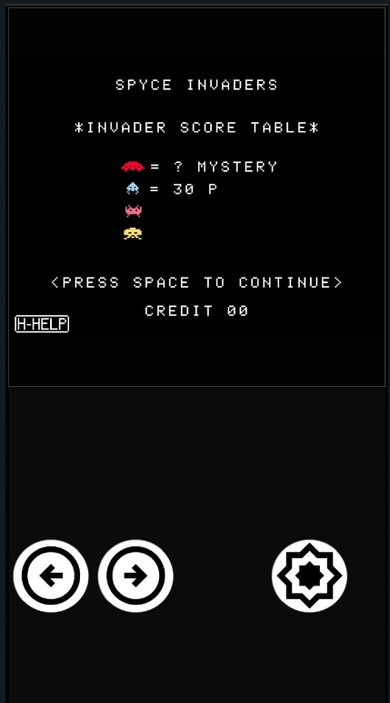

# Solução alternativa para criar gamepads em HTML usando pygame-web
Publicado por [Vinícius F. Maciel](https://github.com/ViniciusFM) (May 30, 2024)

(see in [en-us](mobile-gamepads_en-us.md))

## Introdução

Neste artigo será exposto um método simplista, porém funcional, de como permitir que um jogo criado utilizando [pygame-ce](https://github.com/pygame-community/pygame-ce), e portado para web, interprete comandos vindos de um gamepad inserido no HTML de uma página hospedeira.

Para compreder este artigo, considere o cenário abaixo:

* O objeto de análise aqui é o jogo, desenvolvido pela equipe [Blendify Games](https://www.blendifygames.com.br/), *libre* e open-source [Spyce Invaders](https://github.com/Blendify-Games/SpyceInvaders/) (GPLv3), que é distribuído nas versões desktop, web-desktop e web-mobile.
* Uma página web hospedando o jogo acima feito em pygame-ce e portado para web com [pygame-web](https://pygame-web.github.io/) (Pygbag).
* A aplicação está rodando em um elemento *iframe* na página hospedeita.
* Na página hospedeira é construído um gamepad de três botões: dois botões direcionais (&larr;, &rarr;) e um botão de ação (💥)
* O jogo, originalmnte, aceita apenas comandos vindos do teclado. Os botões no HTML desempenham as ações que são mapeadas para teclas do teclado no jogo, como no recorte abaixo: (acesse o código na integra [aqui](https://github.com/Blendify-Games/SpyceInvaders/blob/master/game.py))

##### Código: *MAPEV - mapping events from html to pygame*

```python
MAPEV = {
    'action': pygame.K_SPACE,
    'left': pygame.K_a,
    'right': pygame.K_d
}
```
* A versão criada com o gamepad atende apenas à categoria de dispositivos móveis. Obviamente esta característica não impede que a mesma metodologia seja aplicada em outros tipos de dispositivos com navegadores web.
* Para ver o resultado da aplicação desta metodologia, acesse o jogo na plataforma [BlendifyGames](https://www.blendifygames.com.br/spyceinvaders) usando um dispositivo móvel:

    <p align="center" width="100%">
        <br>
        <b>Figura: <i>Tela do jogo Spyce Invaders para web-mobile</i></b>
    </p>

## O gamepad na página HTML

O gamepad tem uma configuração simples em HTML. Constitui-se de uma `div` nomeada como `gamepad` que receberá todos eventos de toque sobre a tela. 

##### Código: *spyceinvaders.html*
```html
<!-- spyceinvaders.html -->
<!-- html body -->
    <div id="gamespot__mobile">
        <div id="gamespot__mobile__run-button-container" class="">
            <button id="gamespot__mobile__run-button">
                <i class="material-symbols-outlined">play_circle</i>
                <span> Spyce Invaders </span>
            </button>
        </div>
        <iframe id="gamespot__mobile__game-frame" mozallowfullscreen="true" msallowfullscreen="true" src="" scrolling="no" webkitallowfullscreen="true" allow="autoplay; fullscreen *; geolocation; microphone; camera; midi; monetization; xr-spatial-tracking; gamepad; gyroscope; accelerometer; xr; cross-origin-isolated" allowtransparency="true" frameborder="0" allowfullscreen="true"></iframe>
        <div id="gamepad">
            <div id="gamepad__1__container">
                <div id="gamepad__1__dpad-container">
                    <button id="left"></button>
                    <button id="right"></button>
                </div>
                <div id="gamepad__1__actionbtn-container">
                    <button id="action"></button>
                </div>
            </div>
        </div>
    </div>
<!-- html body -->
```

O elemento `gamepad__1__dpad-container` irá conter os botões direcionais, enquanto que o `gamepad__1__actionbtn-conatainer` irá conter apenas o botão de ação. Observe que os botões são configurados com **IDs** correspondentes às chaves do dicionário [MAPEV](#código-mapev---mapping-events-from-html-to-pygame) inserido dentro do jogo [Spyce Invaders](https://github.com/Blendify-Games/SpyceInvaders).

Não irei entrar em detalhes quanto à especificação gráfica via CSS, uma vez que o código em si não ficou muito "correto". Há vários problemas na estilização da página, que não conseguirei corrigir por agora, mas basta encontrar alguém que tenha habilidades com o CSS que faça um bom trabalho 🥲.

## O funcionamento do gamepad em JavaScript

O código em JavaScript que lida com os eventos de `touch` sobre o componente do gamepad segue abaixo. Nomeei-o como `gamepad-1.js`, pois prentendo criar outras configurações de gamepad para outros jogos no futuro.


##### Código: *gamepad-1.js*
```JavaScript
// gamepad-1.js

const gamepad = document.getElementById('gamepad');
const dpad_c = document.querySelectorAll('#gamepad__1__dpad-container button');
const actbtn = document.querySelectorAll('#gamepad__1__actionbtn-container button')[0];
const frame = document.getElementById('gamespot__mobile__game-frame');
var message = null;

var GPAD_BTNS = [dpad_c[0], dpad_c[1], actbtn];

// this is the structure that will be emitted to
// the SpyceInvaders game. 
var ACTIVE_BUTTONS = [];

// avoid to open menu when long pressing the gamepad components
window.oncontextmenu = function(event) {
    event.preventDefault();
    event.stopPropagation();
    return false;
};

// ------------ Help functions

// if button on, emit its ID to ACTIVE_BUTTON, stop emitting otherwise.
function toggle(button, on) {
    if(on) {
        button.classList.add('pressed');
        if(!(ACTIVE_BUTTONS.includes(button.id)))
            ACTIVE_BUTTONS.push(button.id);
    }
    else {
        button.classList.remove('pressed');
        ACTIVE_BUTTONS = ACTIVE_BUTTONS.filter(id => id !== button.id);
    }
    // this is the message sent to the game iframe
    frame.contentWindow.postMessage(ACTIVE_BUTTONS, "*");
}

// get button widget on where is the touch coordinates (x,y)
// returns null if no button found
function getButtonFromPoint(x, y) {
    for(let i = 0; i < GPAD_BTNS.length; i++) {
        const btn = GPAD_BTNS[i];
        const rect = btn.getBoundingClientRect();
        // is inside button's boundaries?
        if(x >= rect.left && x <= rect.right &&
           y >= rect.top &&  y <= rect.bottom)
           return btn;
    }
}

// ------------ Listeners
// ---- The touch handler functions permit two buttons to
// ---- be pressed simultaneously.

// every time a touch starts, turn "on" the button
function handleTouchOn(e) {
    e.preventDefault();
    const touches = e.touches;
    for(let i = 0; i < touches.length; i++) {
        const touch = touches[i];
        const button = getButtonFromPoint(touch.clientX, touch.clientY)
        if(button && button.tagName.toLowerCase() == 'button') {
            toggle(button, true);
        }
    }
}

// every time a touch end, turn "off" the button released
function handleTouchOff(e) {
    e.preventDefault();
    const touches = e.changedTouches;
    for(let i = 0; i < touches.length; i++) {
        const touch = touches[i];
        const button = getButtonFromPoint(touch.clientX, touch.clientY)
        if(button && button.tagName.toLowerCase() == 'button') {
            toggle(button, false);
        }
    }
}

gamepad.addEventListener('touchstart', handleTouchOn, false);
gamepad.addEventListener('touchend', handleTouchOff, false);
```

A linha mais importante deste código corresponde à exposta abaixo:
    
```JavaScript 
frame.contentWindow.postMessage(ACTIVE_BUTTONS, "*");
```

Esta linha emite o *array* `ACTIVE_BUTTONS` para o *iframe* que integra o código do HTML gerado pelo pygbag do game. Chamaremos esta página integrada de `game.html`, embora a execução do script pygbag a crie como `index.html`.

Aqui o método `postMessage` é chamado a partir do objeto `Window`do *iframe*. O `postMessage` é um método seguro que permite comunicação *cross-origin* entre objetos `Window`.

Em `game.html` deveremos criar o *event listener* para receber a mensagem (Veja a documentação de [postMessage](https://developer.mozilla.org/en-US/docs/Web/API/Window/postMessage)). Este procedimento será feito na próxima [seção](#o-redirecionamento-das-mensagens-emitidas-pelo-gamepad).

## O redirecionamento das mensagens emitidas pelo gamepad

Dentro do código *iframe*, na página `game.html`, foram inseridas as linhas abaixo. O código deverá conter um `event listener` para mensagens enviadas pelo `postMessage` na página hospedeira. 

##### Código: *game.html*
```HTML
<!-- game.html -->

<!-- pygbag code until last script tag -->
<script type="application/javascript">
    
    // ------- pygabg JS code -------

    // create a property for window named "pressedButtons"
    // this property will be accessed by the game in pygame
    // it will contain exactly the same values from
    // ACTIVE_BUTTONS from gamepad-1.js.

    window.pressedButtons = [];

    window.addEventListener("message", (e) => {
        if(Array.isArray(e.data)) {
            window.pressedButtons = e.data;
            console.log(window.pressedButtons);
        }
    });

</script>
```

O bloco `window.addEventListener("message", ...` faz o trabalho de capturar a mensagem da página hospedeira. Perceba que uma propriedade do tipo `array`, nomeada como `pressedButtons`, foi adicionada no objeto `Window` simplesmente para manter o valor de ACTIVE_BUTTONS emitido pelo `postMessage` em [*gamepad-1.js*](#código-gamepad-1js).

A propriedade `window.pressedButtons = []` será acessado pelo código do SpyceInvaders. Na próxima [seção](#recebendo-as-mensagens-no-jogo) esta comunicação será exemplificada.

## Recebendo as mensagens no jogo

Uma pequena mudança foi feita no Spyce Invaders original para conseguir capturar os eventos do gamepad a partir do *array* `window.pressedButtons`:

1) Foi adicionado o dicionário que mapeia os eventos do gamepad para as teclas, o `MAPEV`.
2) Foi adicionado um método `is_key_pressed` para identificar os eventos de tecla pressionada no jogo. Perceba que o método foi implementado de forma que funcione bem tanto para a versão desktop, quanto web e web-mobile.

##### Código: [*game.py*](https://github.com/Blendify-Games/SpyceInvaders/blob/master/game.py)
```Python
# Mapping gamepad events to keyboard
MAPEV = {
    'action': pygame.K_SPACE,
    'left': pygame.K_a,
    'right': pygame.K_d
}

class GameInput(object):
    # -------- game input code --------
    
    def is_key_pressed(self, key):
        ''' 
        this method check if a pygame key is pressed.
        calling example: 
            self.is_key_pressed(pygame.K_SPACE)
        '''

        # check if the system running the game is based 
        # in "emscripten", used by pygbag. This permit 
        # accessing the# window properties of the running page
        if sys.platform == 'emscripten':
            # check if pressedButton exists/contain events
            if platform.window.pressedButtons:
                for ev in platform.window.pressedButtons:
                    if MAPEV[ev] == key:
                        return True
        # the desktop version only checks the get_pressed from pygame
        return pygame.key.get_pressed()[key]

    # -------- game input code --------
```

O método `is_key_pressed` recebe a tecla que deverá ser combinada com o evento presente em `pressedButtons`, no caso do game estar rodando na versão web-mobile, conforme discutimos anteriormente. Para isso, a primeira coisa a ser feita é identificar se a versão do jogo está rodando na plataforma do *pygame-web*. A condição `sys.platform == 'emscripten'` será satisfeita, uma vez que o *pygame-web* assina como `emscripten`, enquanto roda (Veja a documentação do [pygame-web](https://pygame-web.github.io/#all-operating-systems))

Depois, lembre-se que jogo é distribuído em uma versão desktop e duas versões web (web-desktop e web-mobile). As duas versões web acessarão esta condição, mas **somente a versão web-mobile** será capaz de introduzir valores em `pressedButtons`. Desta forma, tanto a versão desktop e web-desktop irão ignorar o mapeamento para gamepad.

## Conclusão

O método se apresenta pouco intrusivo para implantação de gamepads em  aplicações pygame-web, bem como evita problemas de mapeamento comuns às teclas do teclado e não faz uso de `KeyboardEvent` do JavaScript.

O jogo pode ser acessado para testes na plataforma [BlendifyGames](https://www.blendifygames.com.br/spyceinvaders), entretanto, há alguns relatos de problemas ainda não resolvidos para alguns navegadores (ex. Firefox e Safari-mobile). Acredito que não tenha a ver com o método aqui utilizado, mas sim com algumas configurações erradas que fiz ao embutir o jogo no *iframe*.

Esta implementação é inteiramente feita em momento hobbysta, por favor considere que não há garantias de que o método funcione para qualquer tipo de jogo.

